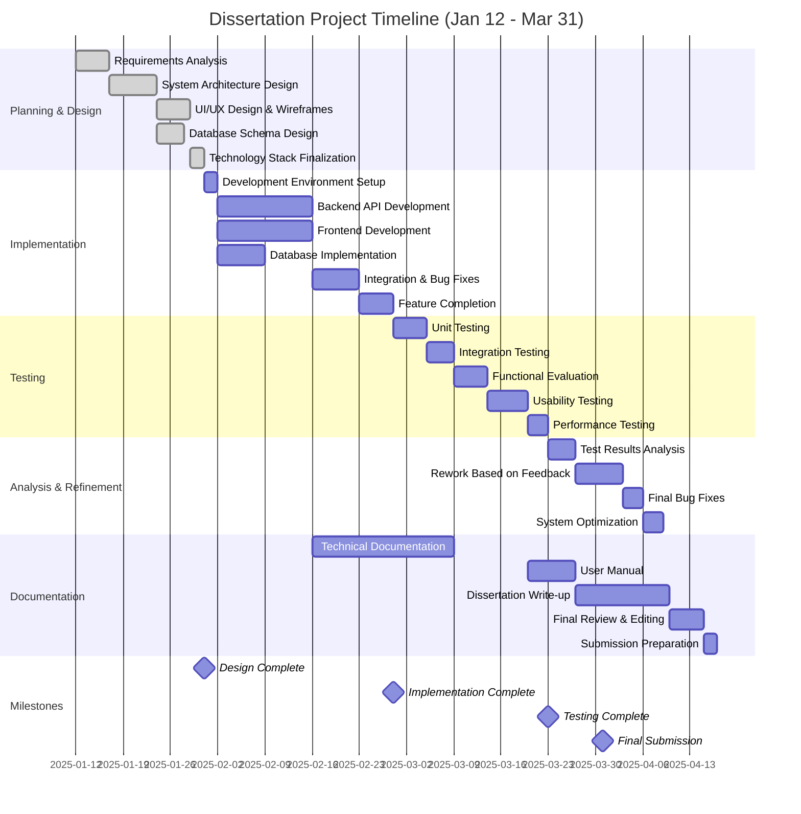

# Project Timeline - Gantt Chart

## Key Dates
- **Start Date**: January 12, 2025
- **Design Phase Complete**: ~January 31, 2025
- **Implementation Complete**: ~February 28, 2025
- **Testing & Evaluation Complete**: ~March 14, 2025
- **Final Submission**: March 31, 2025

## Phase Breakdown

### Phase 1: Planning & Design (Jan 12 - Jan 31)
- Requirements analysis
- System architecture
- UI/UX design
- Database design

### Phase 2: Implementation (Feb 1 - Feb 28)
- Backend development
- Frontend development
- Integration
- Feature completion

### Phase 3: Testing & Evaluation (Mar 1 - Mar 14)
- Functional testing
- Usability testing
- Performance evaluation

### Phase 4: Refinement & Write-up (Mar 1 - Mar 31)
- Analysis of results
- Rework based on feedback
- Dissertation writing
- Final submission prep
