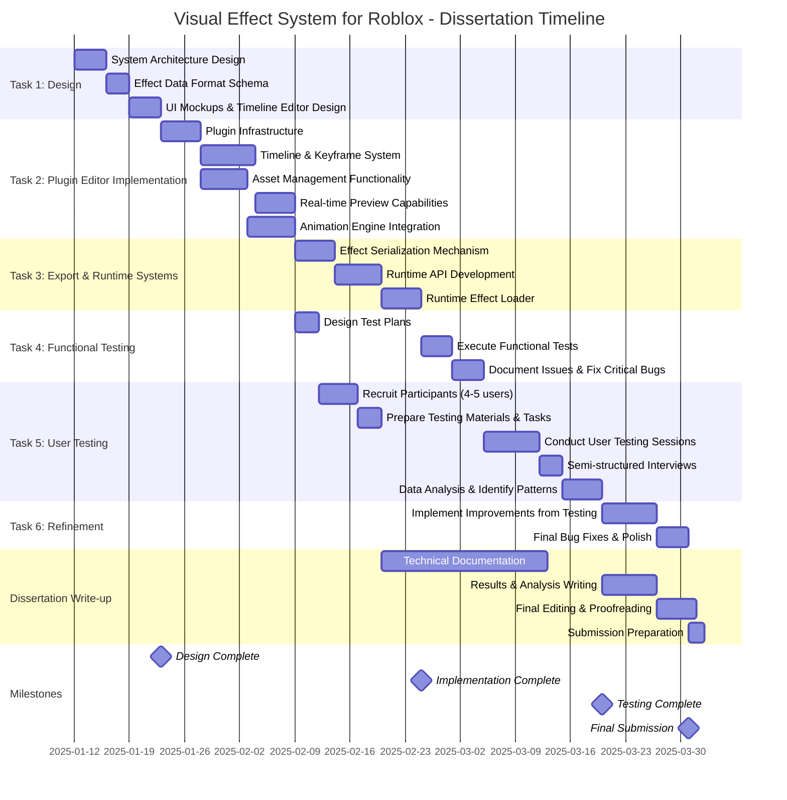

# Project Timeline - Gantt Chart

## Key Dates
- **Start Date**: January 12, 2025
- **Design Complete**: ~January 23, 2025
- **Implementation Complete**: ~February 28, 2025
- **Testing & User Evaluation Complete**: ~March 19, 2025
- **Final Submission**: March 31, 2025

## Task Breakdown (Based on Dissertation Section 3.2 & 3.3)

### Task 1: Design System Architecture and UI (~11 days)
- System architecture documentation
- Effect data format schema
- UI mockups (timeline editor, asset management, preview controls)
- **Requirements**: FR-1, FR-1.1, FR-1.2, FR-2, FR-3, FR-4, NFR-1

### Task 2: Implement Plugin Editor (~29 days)
- Plugin infrastructure using Roblox Plugin API
- Timeline-based animation interface with keyframes
- Asset management system (ParticleEmitters, Beams, Trails, Sounds)
- Real-time preview capabilities
- Animation engine with TweenService integration
- **Requirements**: FR-1 through FR-3.4, NFR-1, NFR-1.1

### Task 3: Implement Export and Runtime Systems (~16 days)
- Effect serialization to ModuleScript format
- Runtime API for effect instantiation
- Runtime loader for executing effects during gameplay
- **Requirements**: FR-4, FR-4.1, FR-5 through FR-5.3, NFR-2

### Task 4: Develop and Execute Functional Tests (~11 days)
- Design comprehensive test plans with traceability to requirements
- Execute manual tests systematically
- Document results and identify issues requiring remediation
- **Requirements**: All FR and NFR requirements

### Task 5: Conduct User Testing and Analysis (~23 days)
- Recruit 4-5 representative Roblox developers
- Prepare realistic effect creation tasks
- Conduct observation sessions with think-aloud protocol
- Perform semi-structured interviews
- Systematic data analysis to identify patterns and recommendations
- **Requirements**: NFR-1, NFR-1.1

### Task 6: Implement Improvements Based on Evaluation (~11 days)
- Address functional deficiencies from testing
- Implement usability improvements from user feedback
- Prioritize by severity and impact
- Document all modifications

### Dissertation Write-up (Parallel & Final Stages)
- Technical documentation (runs parallel to implementation)
- Results and analysis writing (after user testing)
- Final editing and proofreading
- Submission preparation
